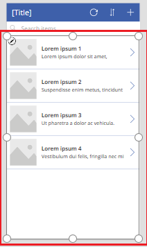
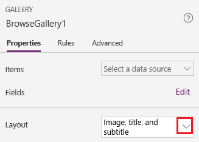
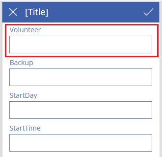
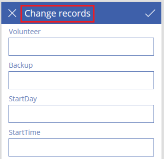
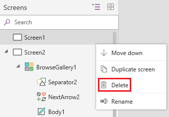
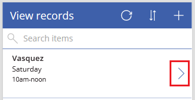

---
lab:
    title: '[Lab 01] Create a canvas app based on Excel Data'
    module: ' Power Apps'
---
# LAB 1 -  Create a canvas app based on Excel Data

# Create a canvas app from scratch based on Excel data

Build a canvas app from scratch using Excel data formatted as a table. You can add data from other sources too. This tutorial will guide you to create an app with two screens: one for browsing records, and another for creating, updating, or deleting records. 


## Task 1 - Create an Excel file

To follow the steps in this tutorial exactly, first create an Excel file using this sample data.

1.  Copy this data, and then paste it into an Excel file.
    
    Expand table
    
    | StartDay | StartTime | Volunteer | Backup |
    | --- | --- | --- | --- |
    | Saturday | 10am-noon | Vasquez | Kumashiro |
    | Saturday | noon-2pm | Ice | Singhal |
    | Saturday | 2pm-4pm | Myk | Mueller |
    | Sunday | 10am-noon | Li  | Adams |
    | Sunday | noon-2pm | Singh | Morgan |
    | Sunday | 2pm-4pm | Batye | Nguyen |
    
2.  Format that data as a table, named **Schedule**, so that Power Apps can parse the information.
    
    
3.  Save the file under the name **eventsignup.xlsx**, close it, and then upload it to a cloud storage account, such as OneDrive.
    

<mark>:information_source:**Note**</mark>Important

Whenever you want to use your own Excel file, remember that the data in the Excel file must be formatted as a table. 


## Task 2 - Open a blank app and connect to data

In PowerApps portal [PowerApps portal](https://make.powerapps.com/), on the left pane select Create > Blank App > Blank Canvas App so you can create a blank canvas app with **Phone** layout.

### Connect to data

1.  Once opened, In the middle of the screen, select **connect to data**.
    
2.  In the **Data** pane, select the connection for your cloud-storage account if it appears. Otherwise, follow these steps to add a connection:
    
    1.  Select **New connection**, select the tile for your cloud-storage account, and then select **Create**.
    2.  If prompted, provide your credentials for that account.
3.  Under **Choose an Excel file**, type or paste the first letters of **eventsignup** to filter the list, and then select the file that you uploaded.
    
4.  Under **Choose a table**, select the checkbox for **Schedule**, and then select **Connect**.
    
5.  In the upper-right corner of the **Data** pane, close it by selecting the close icon (X).
    

## Task 3 - Create the view screen

1.  On the **Home** tab, select the down-arrow next to **New screen** to open a list of screen types, and then select **List**.
    
    A screen is added with several default controls, such as a search box and a **Gallery** control. The gallery covers the entire screen under the search box.
    
2.  At the top of the new screen, select the **Label** control, and then replace **\[Title\]** with **View records**.
    
    
    
3.  In the left navigation bar, select **BrowseGallery1**.
    
    A selection box with handles surrounds the gallery.
    
    
    
4.  On the **Properties** tab of the right-hand pane, select the down arrow for the **Layout** menu.
    
    
    
5.  Select **Title, subtitle, and body**.
    
6.  In the formula bar, replace **CustomGallerySample** with **Schedule**, and replace both instances of **SampleText** with **Volunteer**.
    
7.  On the right edge of the formula bar, select the down arrow, and then select **Format text**.
    
    The formula matches this example:
    
    Power Fx Copy
    
    ```
    SortByColumns(
        Search(
            Schedule,
            TextSearchBox1.Text,
            Volunteer
        ),
        "Volunteer",
        If(
            SortDescending1,
            SortOrder.Descending,
            SortOrder.Ascending
        )
    )
    ```
    
8.  On the **Properties** tab of the right-hand pane, select **Edit** next to the **Fields** label.
    
9.  In the **Title2** box, select **Volunteer**, in the **Subtitle2** box, select **StartDay**, and in the **Body1** box, select **StartTime**.
    
10.  In the upper-right corner of the **Data** pane, close it by selecting the close icon (X).
    

Users can sort and filter the gallery by volunteer name based on the **SortByColumns** and **Search** functions in that formula.

*   If a user types at least one letter in the search box, the gallery shows only those records for which the **Volunteer** field contains the text that the user typed.
*   If a user selects the sort button (between the refresh button and the plus button in the title bar), the gallery shows the records in ascending or descending order (depending on how many times the user selects the button) based on the **Volunteer** field.


## Task 4 - Create the change screen

1.  On the **Home** tab, select the down arrow next to **New screen**, and then select **Form**.
    
2.  In the left navigation bar, select **EditForm1**.
    
3.  On the **Properties** tab of the right-hand pane, select the down arrow next to **Data source**, and then select **Schedule** in the list that appears.
    
4.  Under the data source that you just specified, select **Edit fields**.
    
5.  In the **Fields** pane, select **Add field**, select the check box for each field, and then select **Add**.
    
6.  Select the arrow next to the name of each field to collapse it, and then drag the **Volunteer** field up so that it appears at the top of the list of fields.
    
    
    
7.  In the upper-right corner of the **Fields** pane, close it by selecting the close icon (X).
    
8.  Set the **Item** property of the form to this expression by typing or pasting it in the formula bar:
    
    `BrowseGallery1.Selected`
    
9.  At the top of the screen, select the **Label** control, and then replace **\[Title\]** with **Change records**.
    
    
    


## Task 5 - Delete and rename screens

1.  In the left navigation bar, select the ellipsis (...) for **Screen1**, and then select **Delete**.
    
    
    
2.  Select the ellipsis (...) for **Screen2**, select **Rename**, and then type or paste **ViewScreen**.
    
3.  Select the ellipsis (...) for **Screen3**, select **Rename**, and then type or paste **ChangeScreen**.
    


## Task 6 - Configure icons on the view screen

1.  Near the top of the **ViewScreen**, select the circular-arrow icon.
    
    
    
2.  Set the **OnSelect** property for that icon to this formula:
    
    `Refresh(Schedule)`
    
    When the user selects this icon, the data from **Schedule** is refreshed from the Excel file.
    
    
    
3.  In the upper-right corner of the **ViewScreen**, select the plus icon.
    
    
    
4.  Set the **OnSelect** property for that icon to this formula:
    
    `NewForm(EditForm1);Navigate(ChangeScreen,ScreenTransition.None)`
    
    When the user selects this icon, **ChangeScreen** appears with each field empty, so that the user can create a record more easily.
    
5.  Select the right-pointing arrow for the first record in the gallery.
    
    
    
6.  Set the **OnSelect** property for the arrow to this formula:
    
    `EditForm(EditForm1); Navigate(ChangeScreen, ScreenTransition.None)`
    
    When the user selects this icon, **ChangeScreen** appears with each field showing the data for the selected record, so that the user can edit or delete the record more easily.
    


## Task 7 - Configure icons on the change screen

1.  On **ChangeScreen**, select the "X" icon in the upper-left corner.
    
    
    
2.  Set the **OnSelect** property for that icon to this formula:
    
    `ResetForm(EditForm1);Navigate(ViewScreen, ScreenTransition.None)`
    
    When the user selects this icon, any changes that the user made in this screen are discarded, and the view screen opens.
    
3.  In the upper-right corner, select the checkmark icon.
    
    
    
4.  Set the **OnSelect** property for the checkmark to this formula:
    
    `SubmitForm(EditForm1); Navigate(ViewScreen, ScreenTransition.None)`
    
    When the user selects this icon, any changes that the user made in this screen are saved, and the view screen opens.
    
5.  On the **Insert** tab, select **Icons**, and then select the **Trash** icon.
    
6.  Set the new icon's **Color** property to **White**, and move the new icon so it appears next to the checkmark icon.
    
    
    
7.  Set the **Visible** property for the trash icon to this formula:
    
    `EditForm1.Mode = FormMode.Edit`
    
    This icon will appear only when the form is in **Edit** mode, not in **New** mode.
    
8.  Set the **OnSelect** property for the trash icon to this formula:
    
    `Remove(Schedule, BrowseGallery1.Selected); Navigate(ViewScreen, ScreenTransition.None)`
    
    When the user selects this icon, the selected record is deleted from the data source, and the view screen opens.
    


## Task 8 - Test the app

1.  Select the **ViewScreen**, and then open Preview by pressing F5 (or by selecting the **Preview** icon near the upper-right corner).
    
    
    
2.  Type or paste one or more letters in the search box to filter the list based on the name of the volunteer.
    
3.  Select the sort icon one or more times to show the data ascending or descending order based on the name of the volunteer.
    
4.  Add a record.
    
5.  Update the record that you added, and then save the changes.
    
6.  Update the record that you added, and then cancel the changes.
    
7.  Delete the record that you added.
    
8.  Close Preview mode by pressing Esc (or by selecting the close icon in the upper-right corner).

9.  Press Ctrl-S to save your app in the cloud so that you can run it from other devices.
    


## Congratulations!

You have created a canvas app based on Excel data with two screens.
