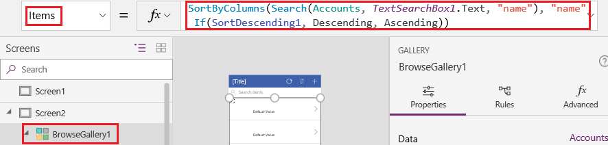
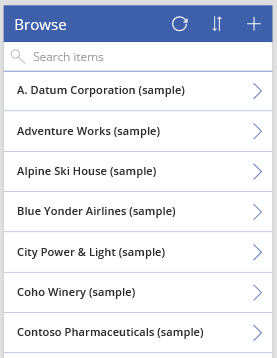
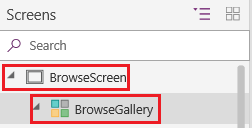
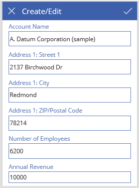

---
lab:
    title: '[Lab 02] Create a Canvas app using Dataverse as a Data Source'
    module: ' Power Apps'
---
# LAB 2 -  Create a Canvas app using Dataverse as a Data Source

Create a canvas app to manage data stored in Dataverse by using standard tables (which are built-in), custom tables (created by your organization), or both.

When developing an application using Dataverse, it is not necessary to establish a connection from Power Apps, unlike with other data sources such as SharePoint, Dynamics 365, or Salesforce. It is only required to specify the tables that need to be displayed or managed within the application.

## Prerequisites

*   Switch to an environment in which you have an access to the database in Dataverse that has some sample data.

## Task 1 - Open a blank app

To create an app from scratch that uses data from Dataverse, the first step is to **create a blank app**. For this exercise, when you create the blank app, ensure you choose **Phone** format.

## Task 2 - Specify a table

1.  In the middle of the screen, select **connect to data**.
    
2.  In the app authoring menu, select **Data**. If this is your first time, you're prompted to create a connection to Dataverse. Select **Create** this connection.
    
3.  Select **Add data** and in the search box enter, **Accounts** > **Connect**.
    
4.  Close the **Data** pane by selecting the close icon in the upper-right corner.
    

## Task 3 - Add a list screen

1.  On the command bar, select **New screen** > **Templates** tab > **List**.
    
2.  In the left navigation bar, select **BrowseGallery1**, and then set the value of the **Items** property to this formula:
    
    `SortByColumns(Search(Accounts, TextSearchBox1.Text, 'Account Name'), "name", If(SortDescending1, SortOrder.Descending, SortOrder.Ascending))`
    
    This formula specifies that:
    
    *   The gallery should show data from the **Accounts** table.
        
    *   The data should be sorted in ascending order until a user selects the sort button to toggle the sort order.
        
    *   If a user types or pastes one or more characters into the search bar (**TextSearchBox1**), the list will show only those accounts for which the **name** field contains the characters that the user specified.
        
        
        
        
3.  Set the gallery's layout to show only the name of each account, and configure the title bar to show the word **Browse**.
    
    
    
4.  In the left app authoring pane, hover over **Screen1**, select the ellipsis icon (...), and then select **Delete**.
    
5.  In the left app authoring pane, hover over **Screen2**, select the ellipsis icon (...), and then select **Rename**.
    
6.  Type or paste **BrowseScreen**, and then rename the gallery in that screen as **BrowseGallery**.
    
    
    

## Task 4 - Add a form screen

1.  Repeat the first step of the previous procedure, except add a **Form** screen instead of a **List** screen.
    
2.  Set the form's **DataSource** property to **Accounts** and its **Item** property to **BrowseGallery.Selected**, as the **Advanced** tab of the right-hand pane shows.
    
3.  On the **Properties** tab of the right-hand pane, select **Edit Fields** to open the **Fields** pane.
    
4.  Select **Add field**, and then select the check boxes for these fields:
    
    *   **Account Name**
    *   **Address 1: Street 1**
    *   **Address 1: City**
    *   **Address 1: ZIP/Postal code**
    *   **Number of Employees**
    *   **Annual Revenue**
    
   
    
5.  Select **Add**.
    
6.  Set the title bar's **Text** property to show **Create/Edit**.
    
    The screen reflects your changes.
    
    
    
7.  Rename this screen **FormScreen**.
    

## Task 5 - Configure icons

1.  On the **BrowseScreen**, set the **OnSelect** property of the circular icon near the top of the screen to this formula:
    
    `Refresh(Accounts)`
    
    
    
2.  Set the **OnSelect** property of the plus icon to this formula:
    
    `NewForm(EditForm1); Navigate(FormScreen, ScreenTransition.None)`
    
    
    
3.  Set the **OnSelect** property of the first arrow pointing to the right to this formula:
    
    `EditForm(EditForm1); Navigate(FormScreen, ScreenTransition.None)`
    
    
    
4.  On the **FormScreen**, set the **OnSelect** property of the cancel icon to this formula:
    
    `ResetForm(EditForm1);Navigate(BrowseScreen, ScreenTransition.None)`
    
    
    
5.  Set the **OnSelect** property of the checkmark icon to this formula:
    
    `SubmitForm(EditForm1); Navigate(BrowseScreen, ScreenTransition.None)`
    
    
    
6.  On the **Insert** tab, select **Icons**, and then select the **Trash** icon.
    
7.  Set the **Trash** icon's **Color** property to **White** and its **OnSelect** property to this formula:
    
    `Remove(Accounts, BrowseGallery.Selected); Navigate(BrowseScreen, ScreenTransition.None)`
    
    
    

## Task 6 - Test the app

1.  On the actions menu, select  **Preview the app**. 

2.  Toggle the list between ascending and descending sort orders, and filter the list by one or more characters in the account name.
    
3.  Add an account, edit the account that you added, start to update the account but cancel your changes, and then delete the account.
    

## Congratulations!

You have learned how to create a Canvas app using Dataverse as a Data Source
