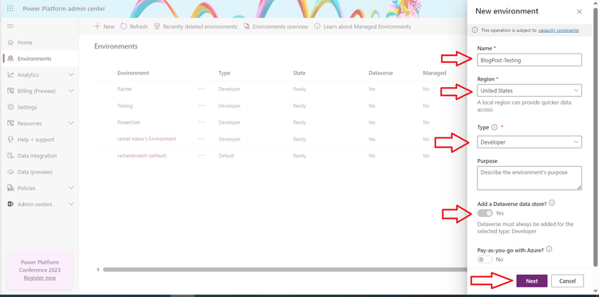
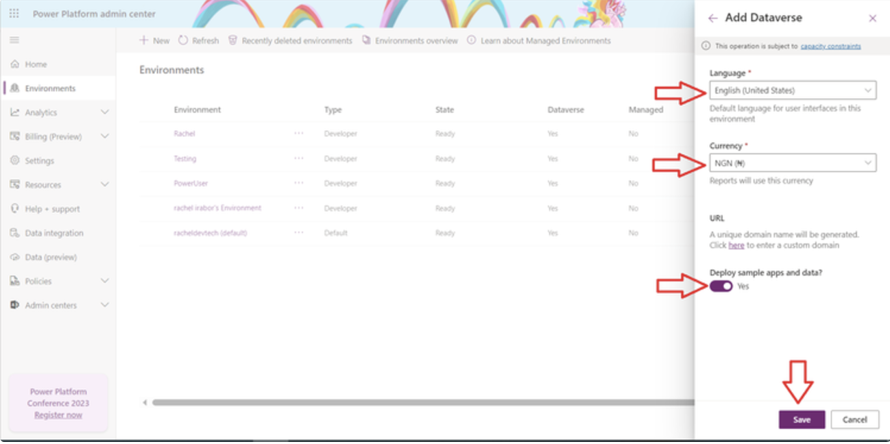

---
lab:
    title: '[Lab 03] Create a Canvas app using Copilot'
    module: ' Power Apps'
---
# LAB 3 - Create a Canvas app using Copilot

Prerequisite: Required software on your computer
--------------------------------------------------------

Copilot is an AI tool that lets you describe in plain English the app you need and the data it should collect. In Microsoft Power Apps, Copilot creates a responsive Canvas App and a Dataverse Table with columns and sample data. To use Copilot, your environment must be deployed in the United States region and set to English (United States).

In this lab, you will learn create a new environment deployed in the United States region and how to create a Leave Management Application using Copilot. For this lab, usage of Microsoft 365 Developer Account will suffice.


## Task 1 - Create an environment and deploy the environment in United States

1. Login into [Power Platform Admin center](https://admin.powerplatform.microsoft.com/)

2. At the left hand side, click on **Environment**


3. Click on **New**
4. After clicking on New, at the right hand side, enter the name of the Environment on Name 

```
BlogPost-Testing
```

*   Select United State as the region 
*   This step is a little tricky here, turn on Add a Dataverse data store 
*   Select Developer on Environment 
*   Click on **Next**



5. After clicking on Next 

*   Language selected should be English Language (United States) 
*   On currency, select the currency you need. 
*   Turn on Deploy sample apps and data? to Yes
*   Click on **Save**



After clicking on Save, wait for a few minutes for the state of the new Environment to change to Ready

If using developer environment in a Microsoft 365 Developer Account has limitation on the number of environments that can created, so please take notice of it. 

If after creating the environment, you get an error message, that means that you need to delete the environment that is being unused and create a new one.

6. Login into [Power Apps](https://make.powerapps.com/) and change the environment to the newly created environment by clicking on  **Environment**
 on the top right portion of the screen.


## Task 2 - Engage Copilot

To show you how Copilot works, let's create an app to track housekeeping tasks for a hotel.

1. Click on Home or go to [Power Apps](https://make.powerapps.com).

1. In the text box, type *hotel housekeeping* and press Enter.

   :::image type="content" source="img/create-app-using-ai-1.png" alt-text="Screenshot of the Power Apps home page, with the Copilot input text box highlighted." lightbox="img/artificial-intelligence/create-app-using-ai-1.png":::

Copilot creates one or more Dataverse tables with data that includes typical hotel housekeeping tasks.

> [!IMPORTANT]
> If you don't have the right permissions and access to Dataverse in the environment you're working in, an alert asks you to create the app in your own environment. Confirm that the table and app can be created in your environment to proceed. If you don't have a personal developer environment, a new one is created for you automatically.

## Review the table

Copilot generates tables and relationships based on your description. Review them and make any changes you need to before you go on to create your app.

### Review the tables for your app

Copilot shows you the tables and relationships that it generated based on your description.

:::image type="content" source="img/data-workspace-copilot.png" alt-text="Screenshot of Dataverse tables and relationships for a hotel housekeeping app, with numbered annotations.":::

Legend:

1. **Edit**: Edit or create more tables in your canvas.

1. **Copilot text box**: [Ask Copilot to modify the table](#use-copilot-to-make-changes) or create more tables for you.

1. **View prompt**: View examples of things that you can ask Copilot to do.

1. **Save and open app**: Save your tables and create your app. To start over, select **Back**.


## Use Copilot to make changes

If you want to change something, enter in the Copilot panel a brief description of the change you want to make. Copilot does it for you.

For example, ask Copilot to add columns to track cleaning start and end time.

1. In the Copilot text box, enter:
```
Add columns to track start and end time
```

Copilot adds two new columns called **Start Time** and **End Time**.

1. Continue editing the table as needed. For example, add room status, change room types, or set a priority level for each room.

1. When you're ready to create your app, select **Save and open app**.

1. Explore the app a bit, and enter the new data, modify the already existing data and even delete the data. 
-------
## Congratulations!

You've now gone through the steps of creating a simple Power Apps application with help of Microsoft 365 Copilot.

    
