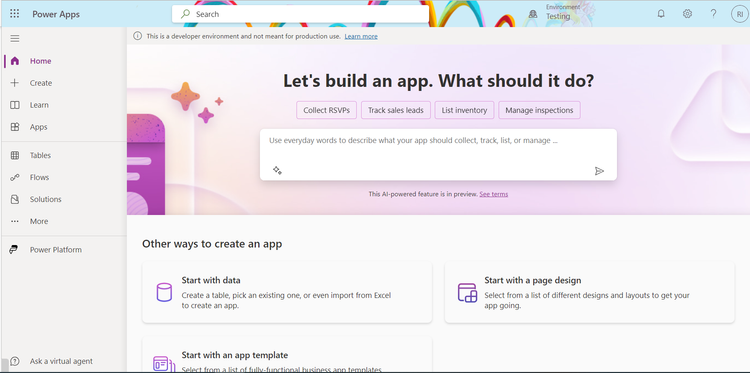

---
lab:
    title: '[Lab 03] Create a Canvas app using Copilot'
    module: ' Power Apps'
---
# LAB 3 - Create a Canvas app using Copilot

Prerequisite: Required software on your computer
--------------------------------------------------------

Copilot is an AI tool that lets you describe in plain English the app you need and the data it should collect. In Microsoft Power Apps, Copilot creates a responsive Canvas App and a Dataverse Table with columns and sample data. To use Copilot, your environment must be deployed in the United States region and set to English (United States).

In this lab, you will learn create a new environment deployed in the United States region and how to create a Leave Management Application using Copilot. For this lab, usage of Microsoft 365 Developer Account will suffice.





## Task 1 - Create an environment and deploy the environment in United States

1. Login into [Power Platform Admin center](https://admin.powerplatform.microsoft.com/)

2. At the left hand side, click on **Environment**


3. Click on **New**
4. After clicking on New, at the right hand side, enter the name of the Environment on Name 

```
BlogPost-Testing
```

*   Select United State as the region 
*   This step is a little tricky here, turn on Add a Dataverse data store 
*   Select Developer on Environment 
*   Click on **Next**


5. After clicking on Next 

*   Language selected should be English Language (United States) 
*   On currency, select the currency you need. 
*   Turn on Deploy sample apps and data? to Yes
*   Click on **Save**


After clicking on Save, wait for a few minutes for the state of the new Environment to change to Ready

If using developer environment in a Microsoft 365 Developer Account has limitation on the number of environments that can created, so please take notice of it. 

If after creating the environment, you get an error message, that means that you need to delete the environment that is being unused and create a new one.

6. Login into [Power Apps](https://make.powerapps.com/) and change the environment to the newly created environment by clicking on  **Environment**
 on the top right portion of the screen.


## Task 2 - Engage Copilot


1. While still on the same page in the text boxt, enter 

```
Leave Management System
```

and wait for it to load


  
Copilot creates a Leave Management System Dataverse Table with columns and a few populated data in the columns. 

Column that has been created 

ID

Name 

Leave Type 

Start Date 

End Date 

Status

Reason 

Comment


Let’s go ahead and create a new column by asking Copilot


2. On the chat at the right hand side, describe the column you want added to the Dataverse Table

Type in the following:

```
Add the Performance Manager Column to the Table
```

Next, click on the icon to send the prompt to Copilot, and the new column, Performance Manager has been created.   
  


3. Click on Create app, and after some time, Copilot will create a responsive Canvas apps application that has a Form and Gallery on the same screen.

4. Explore the app a bit, and enter the new data, modify the already existing data and even delete the data. 
-------
## Congratulations!

You've now gone through the steps of creating a simple Power Apps application with help of Microsoft 365 Copilot.

    
