---
lab:
    title: '[Lab 04] Creating a Canvas app from blank using SharePoint data'
    module: ' Power Apps'
---
# LAB 4 - Creating a Canvas app from blank using SharePoint data


In this lab, you'll create an app to view, edit, add, and delete list items. Customize the app based on your choices or business goals. When renaming controls, ensure you use the correct names in the formula as shown in the steps.

## Task 1 – Create a list using Microsoft Lists

1. Create a list with columns and list items. In this scenario, we've used a list with the following columns and list items:


## Task 2 – Create a blank canvas app

1. Create a **blank Canvas app**.


## Task 3 – Connect app to SharePoint

1.  Select **Data sources** from the left pane.
    
    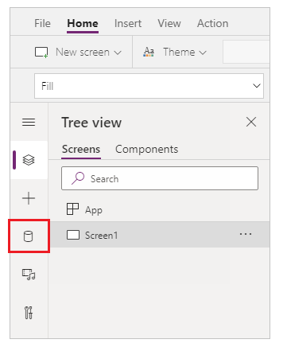
    
2.  Select **SharePoint** data source. You can also search for the name in the search box.
    
    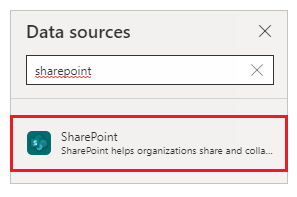
    
3.  Select **Add a connection**.
    
    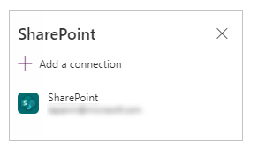
    
4.  Select a connection type. You can connect to SharePoint Online or an on-premises SharePoint site with a data gateway when configured. This scenario connects to a SharePoint Online site.
    
    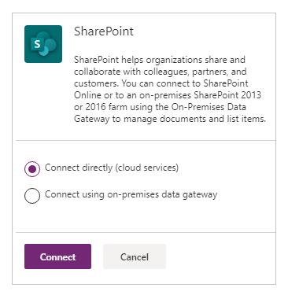
    
5.  Select the SharePoint site having the list you created earlier.
    
    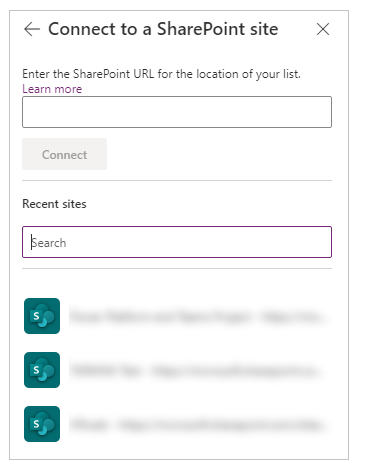
    
6.  Select the list that you created. This scenario uses a list named _Shapes_.
    
    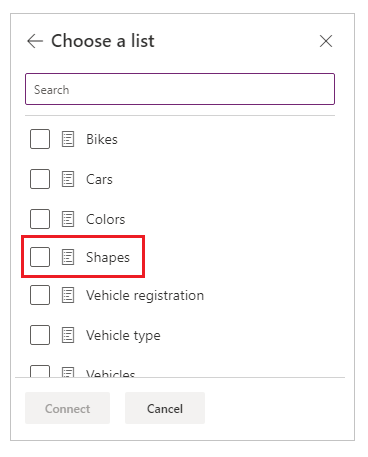
    
7.  Select **Connect**. The data source is added to the app.
    
    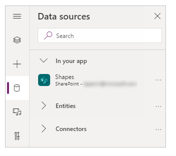
    


## Task 4 – Add data table to view list items

1.  Select **+** (insert) from the left pane.
    
    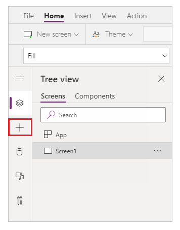
    
2.  Expand **Layout**.
    
3.  Select **Data table**.
    
    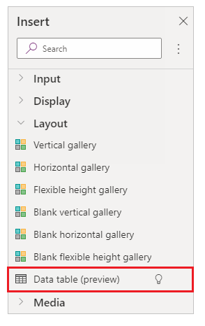
    
4.  Select the data source as your SharePoint connection.
    
    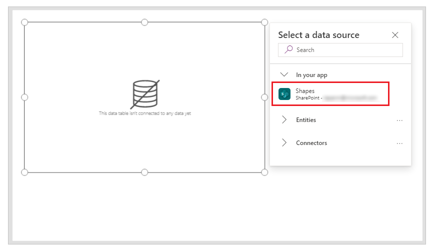
    
5.  Move the data table to the lower-right inside the screen to make space for additional components.
    
    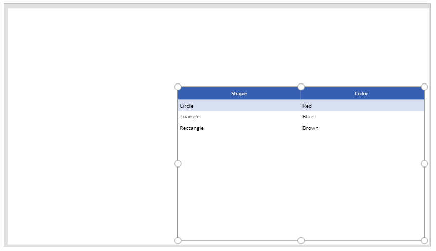
    


## Task 5 – Add the capability to search and select item

1.  Insert a **Text input** control to the canvas, and move it below the drop-down list.
    
    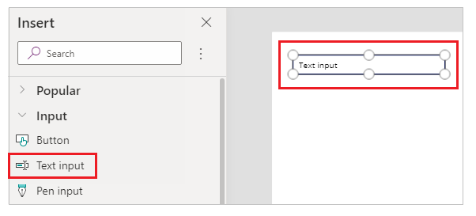
    
2.  Update the search box **Default** property to the value _Search by shape_.
    
    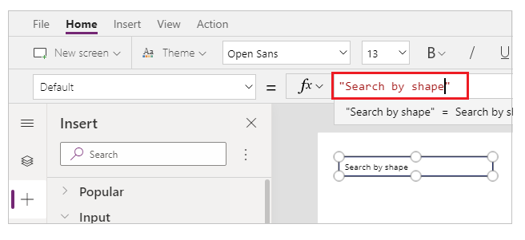
    
3.  Insert a **List box** control to the canvas, and move it below the text input control added in the previous step.
    
    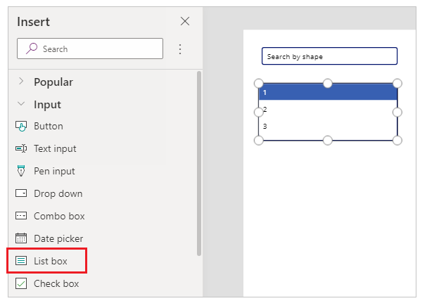
    
4.  From the right side of the Studio screen, set the **Items** property of the list box control to the **Shapes** list for this example.
    
    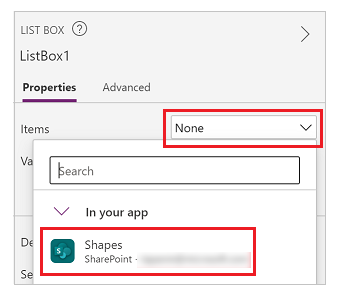
    
5.  Set the **Value** property for the list box control to **Shape** instead of **Color** for this example.
    
    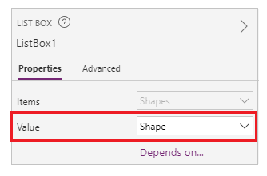
    
6.  Update the **Items** property of the list box added in the previous step to the following formula:
    
    
    ```
    Filter([@Shapes], StartsWith(Shape, TextInput1.Text))
    ```
    
    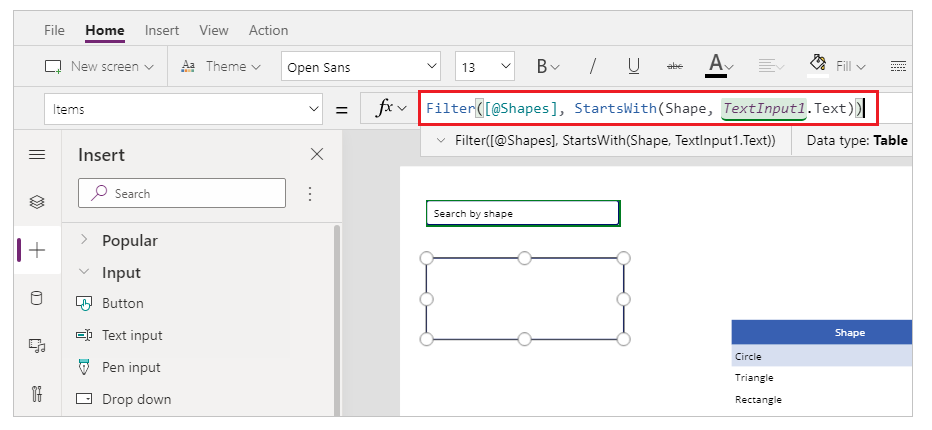
    
    The formula contains following functions:
    
    *   **Filter()** – Used in this formula to filter items in the list box based on the defined parameters. `[@Shapes]` in this function defines which data source to filter.
    *   **StartsWith()**(../functions/function-startswith) – Used in this formula to filter the list items based on the **Shape** column that start with the characters entered in the _TextInput1_ control added earlier.


## Task 6 – Add the capability to edit item

1.  Insert the **Edit form** control.
    
    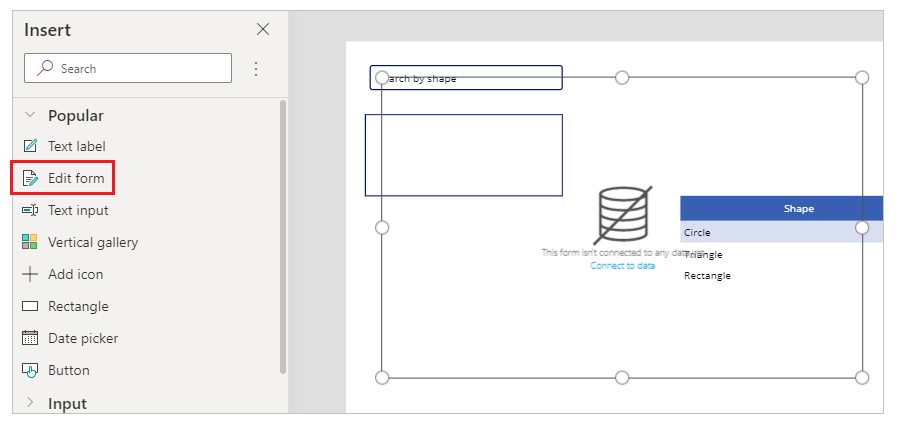
    
2.  From the right side of the Studio screen, set the **Data source** property for the edit form control to **Shapes**.
    
    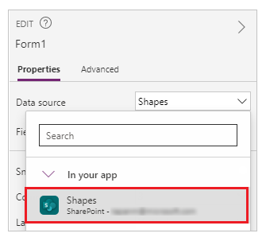
    
3.  Select **Edit fields** for the edit form control and remove any other fields such as **Attachments**, if present.
    
    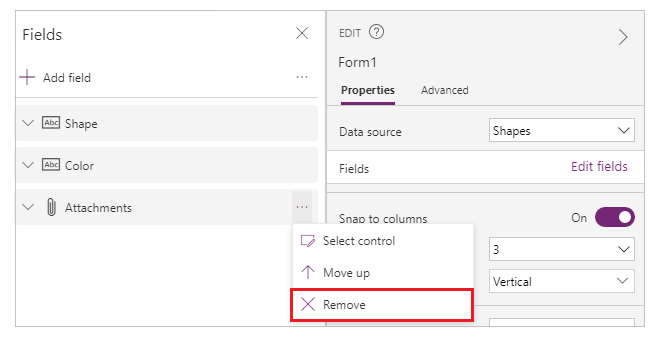
    
4.  Ensure the **Shape** and **Color** fields are present. If not, add them using **Add field**.
    
    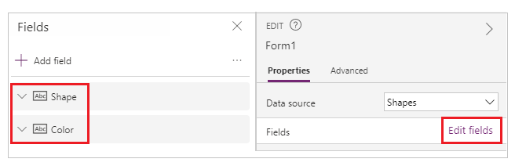
    
5.  Rearrange the screen layout to ensure the **Edit form** control is visible and doesn't overlay with other controls.
    
    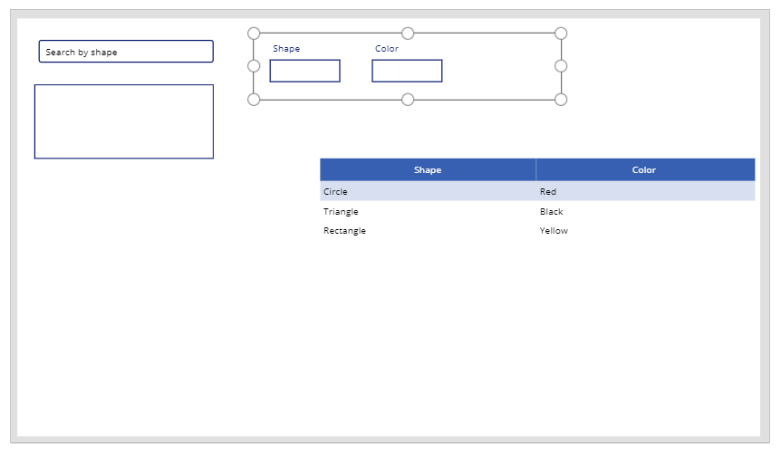
    
6.  Set the **OnSelect** property of the list box control to the following function:
    
    
    ```
    Set(TextSelected,1)
    ```
    
    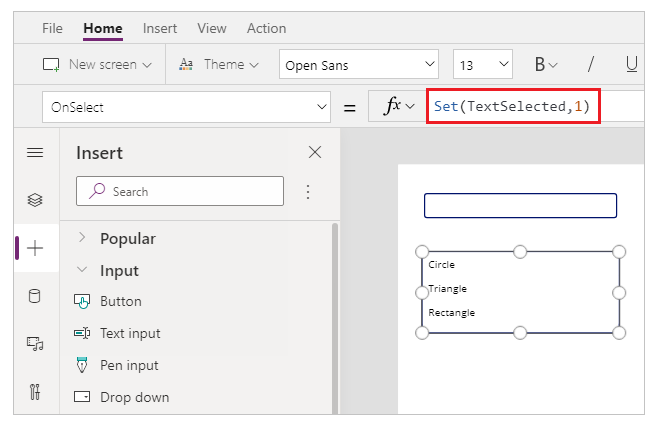
    
    The **Set()** function sets a new variable named _TextSelected_ to the value of _1_ when a value in the list box is selected. The _TextSelected_ variable is used in this scenario as a flag to control the actions and behavior of add, edit, and delete capabilities as you'll see in the following sections.
    
7.  Set the **Item** property of the edit form control to the following formula:
    
    ```
    If(TextSelected=1,ListBox1.Selected,DataTable1.Selected)
    ```
    
    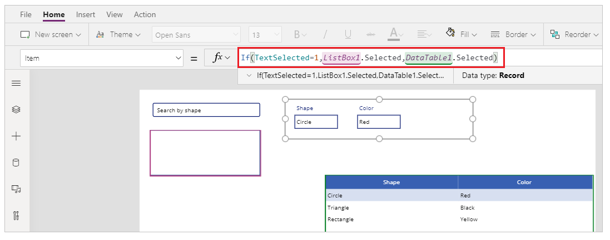
    
    The **If()** function checks first if the value of the variable _TextSelected_ is _1_ or not. If it is, the edit form shows the selected item from the list box. If not, the edit form shows the selected item from the data table.
    
8.  Insert a button.
    
    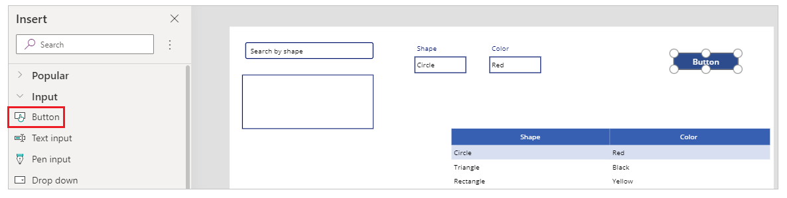
    
9.  From the right side of the Studio screen, set the **Text** property of the button added in the previous step to **Save**.
    
    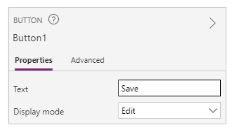
    
10.  Set the **OnSelect** property of the **Save** button to the following formula:
    
    
    ```
    SubmitForm(Form1);
    Set(TextSelected,0)
    ```
    
    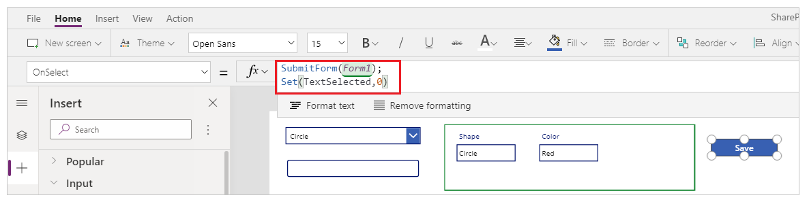
    
    The formula contains following functions:
    
    *   **SubmitForm()** – Used in this formula to submit the edit form and save the values to list.
    *   **Set()** – Resets the _TextSelected_ variable back to _o_ so that a new item can be selected from the list box.
11.  Insert **Text label** control.
    
    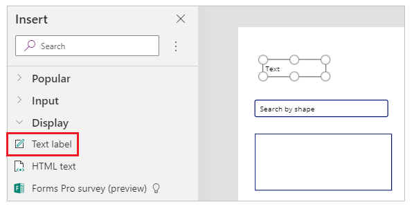
    
12.  Update the **Text** property for the **Text label** control added in the previous step to _To edit value(s) for an item, select from the table, or search._
    
    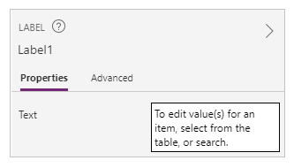
    
13.  Rearrange the controls on the screen to order the edit controls.
    
    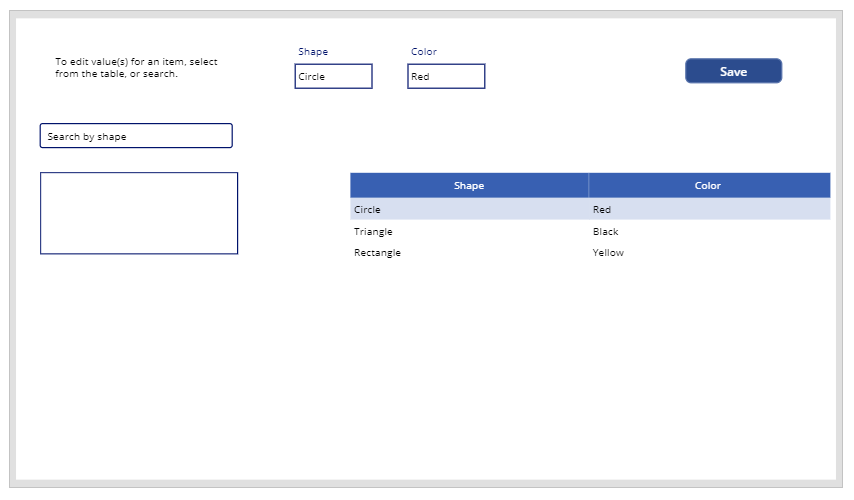
    


## Task 7 – Add the capability to add item

1.  Insert a button.
    
2.  Rearrange the controls on the screen to ensure the button is visible.
    
3.  Update the **Text** property of the button added in the previous step to **Add**.
    
4.  Set the **OnSelect** property of the **Add** button to the following function:
    
    
    ```
    NewForm(Form1)
    ```
    
    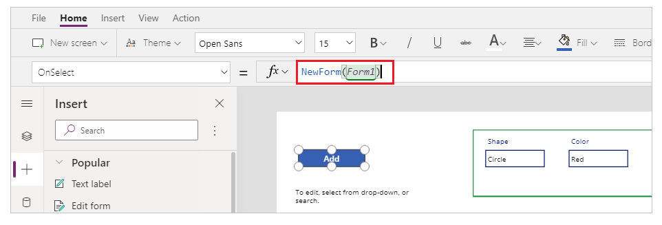
    
    The **NewForm()** function clears the edit form control added on the form named _Form1_ so that you can add a new list item.
    


## Task 8 – Add the capability to delete item

1.  Insert a button.
    
2.  Move the button added in the previous step below the **Save** button.
    
3.  Update the **Text** property of the button added in the previous step to **Delete**.
    
4.  Set the **OnSelect** property of the **Delete** button to the following formula:
    
    
    ```
    Remove([@Shapes], If(TextSelected=1,ListBox1.Selected,DataTable1.Selected));
    Set(TextSelected,0)
    ```
    
    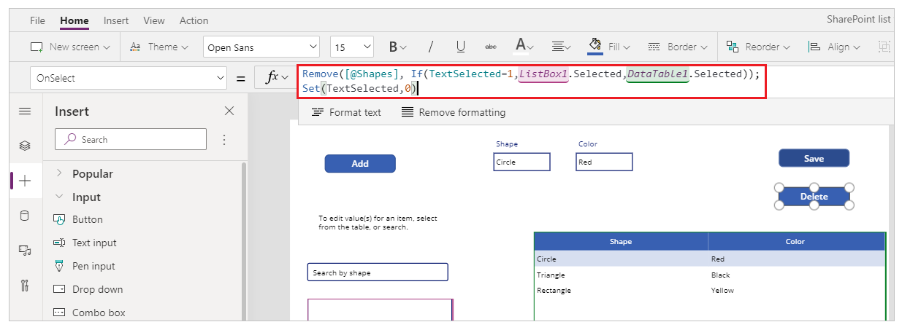
    
    The formula contains following functions:
    
    *   **Remove()**(../functions/function-remove-removeif) – Used in this formula to delete the selected list item.
    *   **If()**(../functions/function-if) – Checks first if the value of the variable _TextSelected_ is _1_ or not. If it is, the **Delete** button deletes the item selected from the list box. If not, the **Delete** button deletes the item selected from the data table control.
    *   **Set()**(../functions/function-set) – Resets the _TextSelected_ variable back to _o_ so that a new item can be selected from the list box.

Now that you have all the app components configured, ensure the screen looks like the following example:

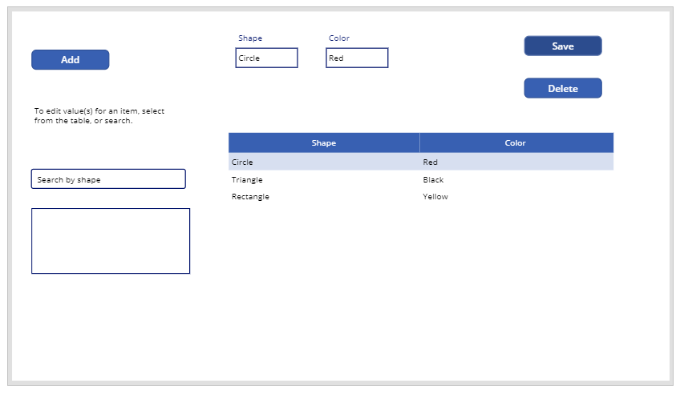


## Task 9 – Save the app

Now that the app has view, edit, add, and delete capability added, save the app:

1.  Select the **File** menu.
    
2.  Select **Save**.
    
3.  When saving for the first time, the **Save** option takes you to **Save as**. Select **Save** to save the app to the cloud.
    
    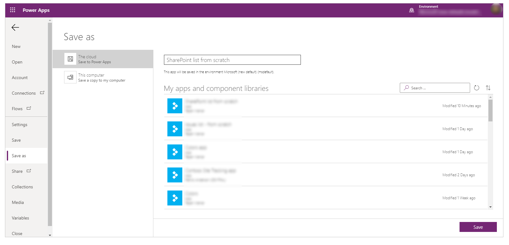
    
4.  Close Power Apps Studio.
    

## Task 10 – Test the app

1.  Go to [Power Apps](https://make.powerapps.com).
    
2.  Select **Apps**.
    
3.  Select the app created.
    
    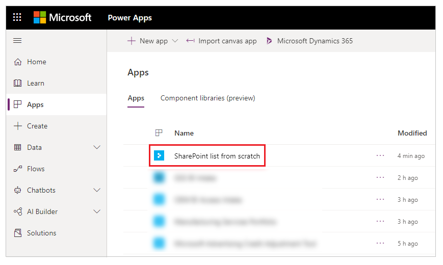
    
4.  Test the app components.
    
    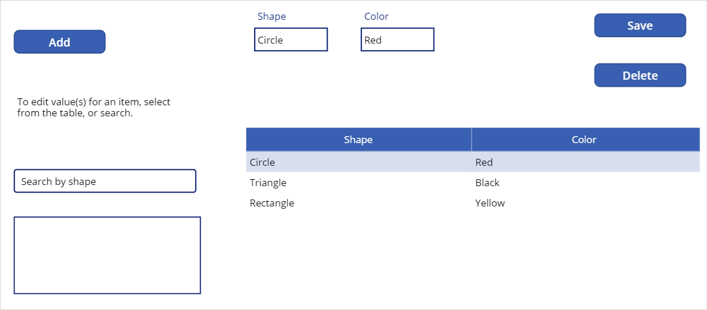
    
    *Tip*
    
    You can quickly preview the behavior of a component using the keyboard key **Alt** and a mouse **left-click** when editing the app inside Power Apps Studio.
    
    For example, instead of selecting **Preview the app** from the upper right, or **F5** from the keyboard that runs the app in preview, keep the **Alt** key on the keyboard pressed, and then select a row from the data table to change the edit form control to the selected row as if the app is running in preview.

    In addition, keep the **Alt** key pressed on the keyboard and you can continue to run the preview inside Power Apps Studio. For example, selecting multiple components for different actions or checks.
    
-------
## Congratulations!

You've now gone through the steps of creating a Canvas app from blank using SharePoint data.

    
