---
lab:
    title: '[Lab 01] Create and test an approval workflow with Power Automate
'
    module: ' Power Automate'
---
# LAB 1 - Create and test an approval workflow with Power Automate

To create an approval workflow, add the Approvals - Start and wait for an approval action to any flow. This allows your flow to manage document or process approvals. For instance, you can approve invoices, work orders, sales quotations, vacation requests, overtime, or travel plans.

Approvers can respond to requests from their email inbox, the approvals center in [Power Automate](https://make.powerautomate.com), or the Power Automate app.

To complete this lab, you must have access to:

*   [Power Automate](https://make.powerautomate.com).
*   A SharePoint Online list.
*   Office 365 Outlook and Office 365 Users account.

## Task 1 - Create an approval flow

Here's an overview of the flow you'll create and test:

The flow performs the following steps:

1.  Starts when someone creates a vacation request in a SharePoint Online list.
    
2.  Adds the vacation request to the approval center, and then emails it to the approver.
    
3.  Sends an email with the approver's decision to the person who requested vacation.
    
4.  Updates the SharePoint Online list with the approver's decision comments.
    

## Task 2 - Create a Sharepoint Online list

Before you create the flow, create a SharePoint Online list. Later, you'll use this list to request approval for vacations.

Create these columns in your SharePoint Online list:

| Column | Type |
| --- | --- |
| Title | Single line of text |
| Start Date | Date and Time |
| End Date | Date and Time |
| Comments | Single line of text |
| Approved | Yes/No |
| Manager Comments | Single line of text |

Make note of the name and URL of the SharePoint Online list. You'll need these items later when you configure the **SharePoint - When an item is created** trigger.

## Task 3 - Create an automated cloud flow

1.  Sign in to [Power Automate](https://make.powerautomate.com).
    
2.  Select **My flows** in the left-side navigation pane.
    
3.  On the top-left menu, select **New flow** > **Automated cloud flow**.
    

## Task 4 - Add a trigger

1.  Give your flow a name.
    
2.  Under **Choose your flow's trigger**, select **When an item is created - SharePoint**, and then select **Create**.
    
3.  On the **When an item is created** card, select the **Site Address** and the **List Name** for the SharePoint list that you created earlier.
    

The **Site Address** and the **List Name** are the items you noted earlier in this walkthrough.

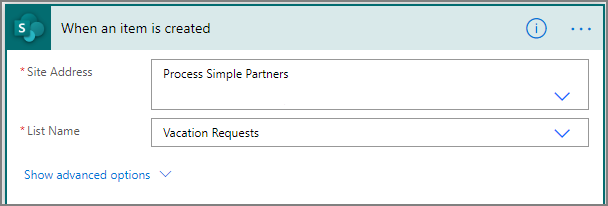

## Task 5 - Add a profile action

1.  Select **New step**, and then type **profile** into the **Choose an action** search box.
    
2.  Select **Office 365 Users**.
    
3.  Find, and then select the **Get my profile (V2)** action.
    
    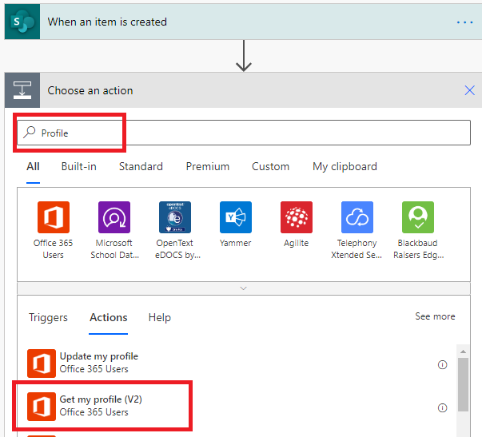
    
4.  Select the fields from your profile that you want to include in your flow, and then select **Create** to save the work you've done so far.
    

## Task 6 - Add an approval action

1.  Select **New step**.
    
2.  Type **approval** into the **Choose an action** search box.
    
3.  Select the **Start and wait for an approval** action.
    
    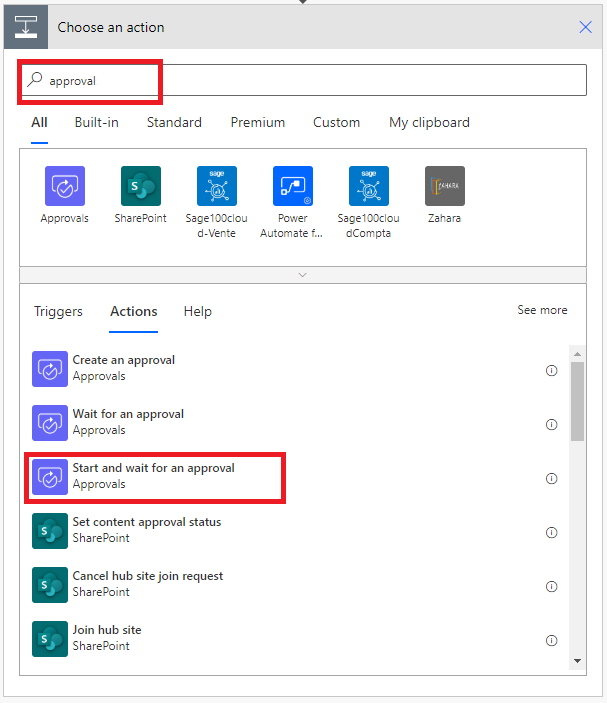
    
4.  Configure the **Start and wait for an approval** card to suit your needs.
    
    The **Approval type**, **Title** and **Assigned To** fields are required. You can use Markdown to format the **Details** field.
    
    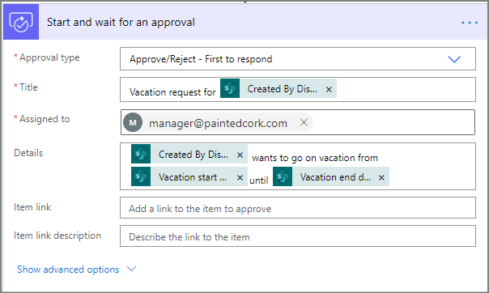
    
    This action sends the approval request to the email address in the **Assigned To** box.

## Task 7 - Add an email action for approvals

Follow these steps to send an email if the vacation request is approved.

1.  Select **Add an action** on the **If yes** branch of the condition.
    
    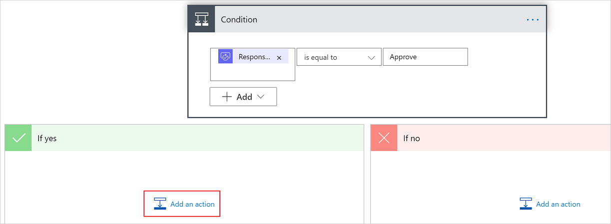
    
2.  Enter **send email** into the search box on the **Choose an action** card.
    
3.  Select the **Send an email (V2)** action.
    
    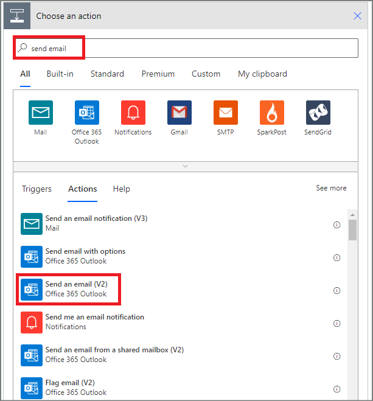
    
4.  Configure the email card to suit your needs.
    
    Note
    
    **To**, **Subject**, and **Body** are required.
    
    This card is a template for the email that is sent when the status of the vacation request changes.
    
    In the **Body** box on the **Send an email (V2)** card, use the **Comments** token from the **Approvals - Start an approval** action.
    

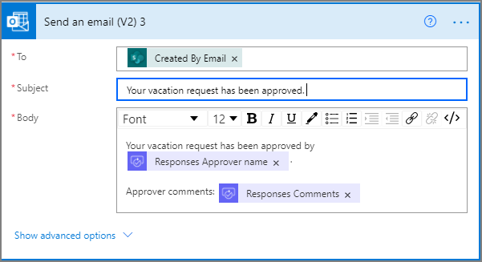

## Task 8 - Add an update action for approved requests

1.  Select **Add an action** in the **If yes** branch.
    
2.  Enter **SharePoint** in the search box on the **Choose an action** card, select the **SharePoint** filter, and then select the **Update item** action.
    
    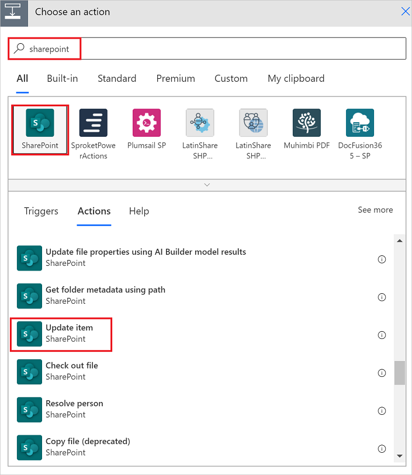
    
3.  Configure the **Update item** card to suit your needs.
    

Note

**Site Address**, **List Name**, **Id**, and **Title** are required.

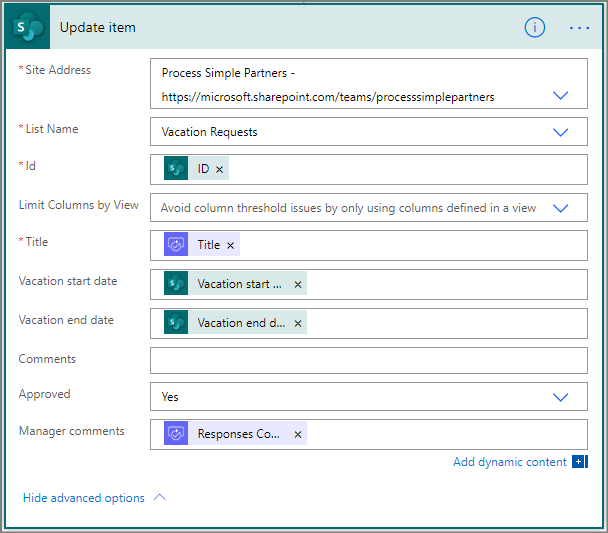

## Task 9 - Add an email action for rejections

1.  Select **Add an action** on the **If no** branch.
    
2.  Enter **Send** into the search box of the **Choose an action** card, select **Office 365 Outlook** to filter the actions, and then select the **Send an email (V2) - Office 365 Outlook** action.
    
    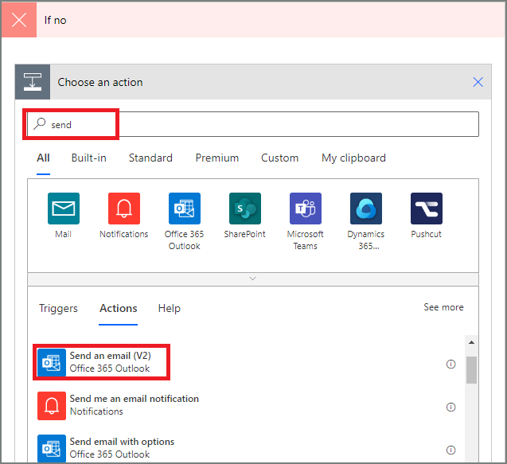
    
3.  Configure the email card to suit your needs.
    
    This card represents the template for the email that's sent when the status of a vacation request changes.
    

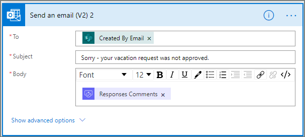

## Task 10 - Add update action for rejected requests

1.  Select **Add an action**.
    
2.  Enter **update** into the search box on the **Choose an action** card, and then select the **Update item - SharePoint** action.
    
    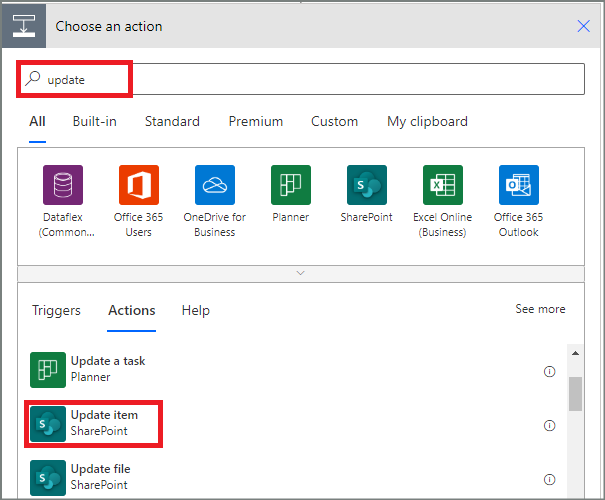
    
3.  Configure the card to suit your needs.
    

Note

**Site Address**, **List Name**, **Id**, and **Title** are required.

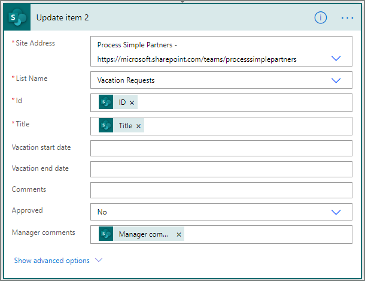

4.  Select **Save** to save the work we've done.

If you've followed along, your flow should resemble this screenshot:

Now that we've created the flow, it's time to test it!

## Task 11 - Request an approval to test your flow

Create a vacation request in the SharePoint Online list you created earlier.

After you save this request, the flow triggers, and then:

1.  Creates a request in the approvals center.
2.  Sends an approval request email to the approvers.

## Task 12 - Create long-running approvals

If it's likely that your flow will run for more than 30 days, consider storing your approvals in Microsoft Dataverse. This makes it possible for you to create flows that act on responses to approval requests, even after the original flow run times out.

To do this, use two flows, one to send an approval request, and the other to run business logic on the responses to the approval request, based on the **Create an approval (v2)** action

If you use modern email clients, you don't have to wonder if a request is still required because Power Automate automatically updates the email to indicate that the approval request is completed.

## Task 13 - Cancel an approval request

Sometimes you might want to cancel an approval request that you've sent. Possibly you made a mistake in the request, or it’s no longer relevant. In either case, the person who sent the request can cancel it by following these steps:

1.  Select the approval
2.  Select **Cancel approval** in the side pane.

Tip

You can always select the **History** tab to view the approval requests that you've canceled.

Note

The cancel feature is supported on the **Create an approval (v2)** action.

-------
## Congratulations!

You've now gone through the steps of creating and testing approval workflow in Power Automate.

    
