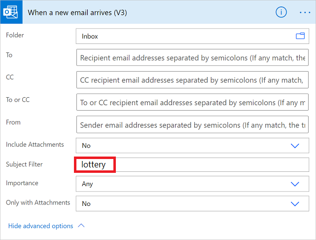
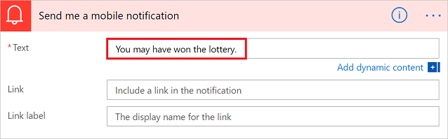

---
lab:
    title: '[Lab 02] Trigger a cloud flow based on email subject'
    module: 'Power Automate'
---
# LAB 2 - Trigger a cloud flow based on email subject

 In this lab you will use the **When a new email arrives (V3)** trigger to create a cloud flow that runs when email subject match criteria that you provide.

| Property | When to use |
| --- | --- |
| Folder | Trigger a cloud flow whenever emails arrive in a specific folder. This property can be useful if you have rules that route emails to different folders. |
| To  | Trigger a cloud flow based on the address to which an email was sent. This property can be useful if you receive email that was sent to different email addresses in the same inbox. |
| CC  | Trigger a cloud flow based on the CC address to which an email was sent. This property can be useful if you receive email that was sent to different email addresses in the same inbox. |
| From | Trigger a cloud flow based on the sender's email address. |
| Importance | Trigger a cloud flow based on the importance with which emails were sent. Emails can be sent with high, normal, or low importance. |
| Has Attachment | Trigger a cloud flow based on the presence of attachments in incoming emails. |
| Subject Filter | Search for the presence of specific words in the subject of an email. Your flow then runs actions that are based on the results of your search. |

In the following tasks, you will check all email's subject property in the **when a new email arrives (V3)** trigger. 

To succesfully run this lab, you will need to have:

*   An account with access to [Power Automate](https://make.powerautomate.com).
    
*   An email account with Outlook for Microsoft 365 or Outlook.com.
    
*   The Power Automate mobile app for [Android](https://aka.ms/flowmobiledocsandroid) or [iOS](https://aka.ms/flowmobiledocsios)
    
*   Connections to Office, Outlook, and the push notification service.
    

## Task 1 - Trigger a cloud flow based on an email's subject

In this tutorial, we create a cloud flow that sends a push notification to your mobile phone if the subject of any new email has the word "lottery" in it. Your flow then marks any such email as **read**.

Although this lab sends a push notification, you're free to use any other action that suits your workflow needs. For example, you might store the email contents in another repository such as Google Sheets or a Microsoft Excel workbook stored on Dropbox.

1.  Sign in to [Power Automate](https://make.powerautomate.com).
    
2.  On the left pane, select **My flows**.
    
3.  Select **New flow** > **Automated cloud flow**.
    
4.  In the **Flow name** field, enter a name for your flow.
    
5.  In the **Choose your flow's trigger** field, enter **new email**.
    
6.  Select **When a new email arrives (V3)** from the list of triggers. This trigger runs each time an email arrives.
    
7.  Select **Create**.
    
8.  Select the folder that you'd like the flow to monitor for incoming emails, and then select **Show advanced options**.
    
    To display all your email folders, select the **Show Picker** icon, which is located on the right side of the **Folder** box on the **When a new email arrives (V3)** card.
    

## Task 2 - Configure a cloud flow

1.  Select the folder that you'd like the flow to monitor for incoming emails, and then select **Show advanced options**.
    
    To display all your email folders, select the **Show Picker** icon, which is located on the right side of the **Folder** box on the **When a new email arrives (V3)** card.
    
2.  In the **Subject Filter** box, enter the text that your flow uses to filter incoming emails.
    
    In this example, we're interested in any email that has the word "lottery" in the subject.
    
    
    

## Task 3 - Add a mobile notification action

1.  Select **New step**.
    
2.  Search for **notification**, and then select **Send me a mobile notification** from the list of actions.
    
3.  Enter the details for the mobile notification you want to receive when you receive an email that matches the **Subject Filter** you specified earlier.
    
    
    

## Task 4 - Add a read/unread action

1.  Select **New step**.
    
2.  Search for **read**, and then select **Mark as read or unread (V3)** from the list of actions.
    
3.  In the **Mark as read or unread** card, add the **MessageId** token in the **Message Id** box.
    
    If the **Message Id** token isn't visible, search for it by entering **Message Id** in the search box.
    

4.  Select **Save** at the top of the page, and now you will be able to receive a push notification each time you receive an email that contains the word "lottery" in the subject.

-------
## Congratulations!

You've learned how to trigger a cloud flow based on email subject!