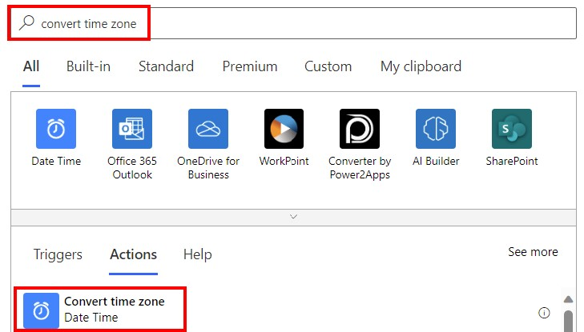
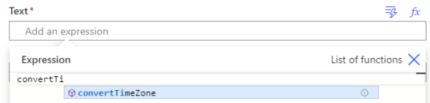
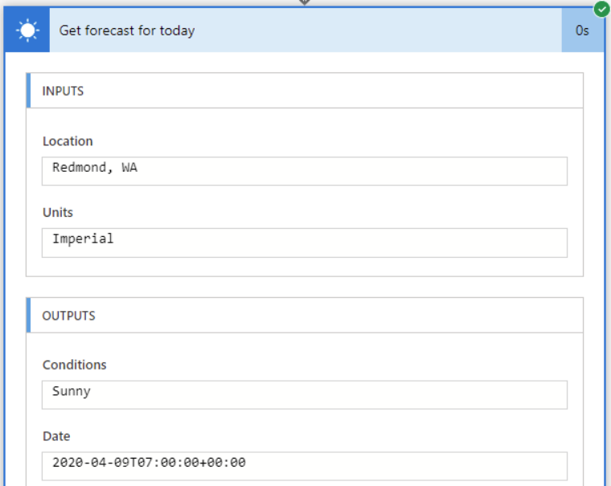

---
lab:
    title: '[Lab 03] Convert time in Power Automate'
    module: ' Power Automate'
---
# LAB 3 - Convert time in Power Automate

In this lab you will learn how to convert the time zone to the intended time zone in a Power Automate trigger or action.

When passing datetimes through triggers and actions in Power Automate flows, you might find that the time zone isn't what you expected, or you might wish to convert the time zone (frequently in Coordinated Universal Time (UTC)) to your local time. You can do this using the **Convert time zone** action or the `convertTimeZone` expression.

Dates are passed through services in varying formats or time zones, so each connector might use a different datetime format or time zone. Some services strictly use UTC time to avoid confusion.

## Task 1 Convert a time zone using an action

Power Automate has a built-in operation called **Convert time zone**.

1.  Sign in to [Power Automate](https://make.powerautomate.com).
    
2.  Find an existing flow which has date/time data type and select **Edit** to add an action or create a manually triggered flow and add MSN Weather connector.
    
3.  In the **Search** box, type **convert time zone** and choose the built-in **Convert time zone** operation.
    
    
    
4.  Add the required and optional inputs for the **Convert time zone** operation.
    
    *   **Base time**: The datetime you wish to convert.
    *   **Source time zone**: The time zone that the datetime is currently in.
    *   **Destination time zone**: The time zone you want to convert your date to.
    *   **Format string** _(Optional)_: The string that specifies the desired format of the converted time.
5.  Add the Outlook connector and send an e-mail to yourself putting converted value into the body.
    
## Task 2 - Convert a time zone using an expression

In this task, you will replace Convert Time zone action with the expression.

Power Automate has an expression function `convertTimeZone` that converts a timestamp from the source time zone to the target time zone.



Here's an example of the function in the console:

```
convertTimeZone(timestamp: string, sourceTimeZone: string, destinationTimeZone: string, format?: string)
```

The function takes the following parameters:

*   `timestamp`: The datetime you wish to convert.
*   `sourceTimeZone`: The time zone the datetime is currently in.
*   `destinationTimeZone`: The time zone you want to convert your date to.
*   `format` (optional): The format of the time zone you wish to convert your date to.


## Task 3 - Convert a time zone

This example converts a time zone to the specified time zone and format.


```
convertTimeZone('2018-01-01T80:00:00.0000000Z', 'UTC', 'Pacific Standard Time', 'D')
```

It returns the result: `Monday, January 1, 2018`.


## Task 4 - Use dynamic content

This is an example of using dynamic content in the expression. Here, the `triggerBody()?['Date']` timestamp is the dynamic content you want to format. The source time zone is `UTC`. The destination time zone is `Eastern Standard Time`. The format is the custom format string `HH:mm`.

```
convertTimeZone(triggerBody()?['Date'],'UTC','Eastern Standard Time','HH:mm')
```


## Task 5 - Decipher a datetime

*   Datetimes might have different formats. If your datetime has a `Z` at the end, it means it's in UTC time.
    
    **Example**: `2020-04-10T01:28:14.0406387Z`
    
*   You might receive an error that states your date time string isn't in the correct format.
    
    **Example**: 'The date time string must match ISO8601 format.'
    
    
## Task 6 - Check the time zone of an output

When you're unsure what format the datetime time zone is currently in, you can run your flow and see the datetime output format.

In this example, the **Get forecast for today** operation outputs the timestamp for when you got the forecast.



This datetime uses the ISO-8601 datetime format. This operation outputs the datetime in the UTC time zone.

## Task 7 - Convert a timestamp to or from UTC

To convert a timestamp from the source time zone to UTC, or from UTC to the target time zone, use the **convertFromUtc** and **convertToUtc** expression functions.

## Congratulations!

You've learned how to Convert a time by using Power Automate!
    
