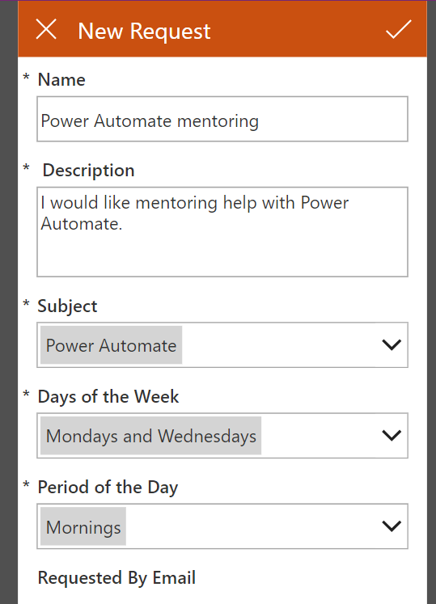
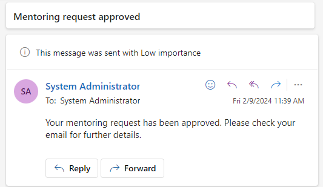

---
lab:
    title: '[Lab 05] Use Copilot to design and edit flows'
    module: 'Power Automate'
---
# LAB 5 - Use Copilot to design and edit flows

## Task 1 - Import a solution

In this task, you import a mentoring management solution. The solution includes a model-driven application that manages mentoring requests, a canvas application that allows users to submit mentoring requests, and two tables: one for mentoring requests and one for mentors. This exercise includes a completed cloud flow that's currently turned off.

1.  Download the [MentoringSolution\_1\_0\_0\_1 zip file](https://github.com/MicrosoftDocs/mslearn-developer-tools-power-platform/blob/master/power-apps/copilot-power-automate/MentoringSolution_1_0_0_1.zip). The file is included. You need to select the ellipsis (three dots) and select download.
    
2.  Go to [https://make.powerautomate.com/](https://make.powerautomate.com/) and make sure you that have the correct environment selected.
    
3.  Select **Solutions > Import solution**.
    
    
    
4.  Select the **Browse** button.
    
5.  Find and select the **MentoringSolution\_1\_0\_0\_1**.**zip** file on your device and then select **Open**.
    
6.  Select **Next**.
    
7.  Select **Next** again.
    
8.  Select **Continue**.
    
    
    
    This solution uses the three connectors as shown in the following screenshot.
    
    
    
9.  Select **Import** and wait for the solution to import.
    
    You should get a message when the solution import is complete.
    
10.  Select **Publish all customizations** and then wait for the publishing to complete.
    
    
    
11.  Don't navigate away from this page.
    

## Task 2 - Prepare the solution

In this task, you run the Mentoring Manager application and add mentors' data.

1.  Select **Apps**, select the **Mentoring Manager** application, and then select the **Play** button.
    
    
    
2.  Select **Mentors** from the left navigation and then select **\+ New**.
    
3.  Enter **Jim Glynn** for the **Name**, select **Power Automate** for **Subject**, enter **Mondays and Wednesdays** as the **Days of the Week**, and enter **Mornings** as the **Period of the Day**.
    
4.  Select the **Contact** field and create a New contact for Jim Glynn. A quick create panel opens on the right side of your screen. Enter Jim for the First Name field and Glynn for the Last Name field. Then Save and Close. When complete, your form looks similar to the screenshot below. Select **Save and Close** on the New Mentor form to continue.
    
    
    
5.  In similar fashion, create three more mentors: Maria Campbell, Nancy Anderson, and Patrick Sands.
    
    You should now have four mentors showing on the **Active Mentors** screen.
    
    
    
6.  You can close the Mentoring Manager application.
    

## Task 3 - Create a flow with Copilot

In this task, you use Copilot for Power Automate to create a cloud flow to trigger when someone creates a new mentoring request. The flow tries to find a mentor that matches the subject of the mentoring request. If it doesn't find one, the flow sends an email to the requestor. If the flow finds a match, it sends an approval request and then waits for the outcome. Then, the flow checks if the request was approved. If the approval request is approved, the flow sends an email to the requestor, assigns a mentor, and then sets the approval status to Approved. If the approval wasn't approved, the flow sends an approval rejection email to the requestor.

Note

As Copilots mature, your results might not exactly match the results in this exercise. If so, review the steps in this exercise and then try your own steps to gain similar results from the mentor app.

1.  Go to [https://make.powerautomate.com/](https://make.powerautomate.com/) and make sure that you have the correct environment selected.
    
2.  Go to the Copilot prompt, enter the following text, and then select the **Generate** button:
    
    **A flow for matching mentoring requests to mentors, and then processes approval request for the mentoring request.**
    
    
    
3.  Copilot suggests a flow that might resemble the following image. You might notice that your suggested flow doesn't use Dataverse.
    
    
    
4.  Give Copilot more context. Scroll up to the Copilot prompt, enter the following text, and then select the **send** button. Notice that the following prompt adds _When a row is added to a Dataverse table, create_.
    
    **When a row added to a Dataverse table, create a flow for matching mentoring requests to mentors, and then processes approval request for the mentoring request.**
    
5.  Copilot should now offer a different suggestion incorporating Dataverse. The suggestion might resemble the following image. If yours doesn't suggest something similar, you can try tweaking the wording in your request box.
    
    
    
6.  Give Copilot more information. Enter the following text into the Copilot prompt and then select the **send** button:
    
    **When a row is added to a Dataverse table, retrieve the details of the mentoring request and list available mentors. If a mentor with a matching subject is found, start an approval and wait. If the approval outcome is "Approve," update the mentoring request and send approved email to the requester. If the outcome isn't "Approve," update the request and send a rejected email to the requester. If no matching mentor is found, send a notification email to the requester..**
    
7.  Copilot should now suggest a flow that resembles the following image. Select the **Next** button to continue to Step 2. If your suggested flow isn't what you want, try changing the description until you get something that's close to what you want.
    
    
    
8.  On the Step 2 screen, check your connections, then select **Create flow**.
    
    The created flow should resemble the following image.
    
    
    
9.  Don't navigate away from this page.
    

## Task 4 - Edit the flow

Even if Copilot creates exactly what you wanted, you still need to complete configuration, such as selecting the correct tables and columns. It's also good practice to give the steps better and logical names that make sense to you.

These steps are detailed and manual. Try asking Copilot to complete some of the steps instead.

In this task, you rename the steps and edit the flow that Copilot created for you.

1.  Give the flow a good name. Name the flow **Process mentoring requests**.
    
    
    
2.  Select the trigger of the flow and change the name to **When a new mentoring request is added**.
    
    
    
3.  Select **Added** for **Change Type**, select **Mentoring requests** for **Table Name**, select **Organization** for **Scope**, and then select the **Get a row by ID** action. If your suggested flow didn't include this step, go ahead and add it in manually.
    
    
    
4.  Rename the step to **Get mentoring request**.
    
5.  Find/select **Mentoring requests** for **Table Name** and then remove any value from the **Row ID** field if one shows.
    
6.  Select the **Row ID** field and then select the **Enter data from previous step** (dynamic content) icon.
    
    
    
7.  Select **Mentoring request** from the dynamic content pane.
    
    
    
8.  Select the **List rows** action and then rename it to **List mentors**.
    
9.  Find/select **Mentors** for **Table Name**.
    
10.  Select the **Show all** button next to _Advanced parameters_.
    
11.  For **Filter Rows** input **contoso\_available eq true**.
    
    
    
12.  For **Row Count** enter **1**.
    
13.  Select the condition below the List members action.
    
14.  Rename the condition to **Check for matching mentor**.
    
15.  Select the left **Choose a value** field and then select the dynamic content icon.
    
16.  Select the **Subject** under the **Get mentoring request** action.
    
    
    
17.  Select **Is equal to** or **Is not equal to**, depending on which side of the approval that Copilot placed the approval step.
    
18.  Select the right **Choose a value** field and then select the dynamic content icon.
    
19.  Select the **Subject** under the **List mentors** action.
    
    
    
    Power Automate adds a **For each** control to your flow.
    
    
    
20.  Select the **Send an email** action inside the branch of the **Check for matching mentor** condition that doesn't have the approval. If the **Send an email** step is missing, you can add one in!
    
21.  Review the email body and then rename it to **Send no match email**. Remove any **To** value.
    
22.  Select the **To** input field, then select **Enter custom value**, then select the dynamic content icon.
    
23.  Select **Requested By Email** of the **Get mentoring request** step from the Dynamic content pane.
    
    
    
    For the email subject, input "No mentoring match found." For the email body, input "Sorry, there is no mentor available currently."
    
24.  Select the **Start and wait for an approval** step.
    
25.  Change the **Approval Type** to **Approve/Reject - First to respond**.
    
26.  Enter **Mentoring request** in the **Title** field.
    
27.  Select the **Assign To** field and then select the dynamic content icon.
    
28.  Select **Requested By Email** of the **Get mentoring request** step from the **Get mentoring request** action. Usually, this request goes to the person who manages mentoring requests, but to make testing easier, you use the requester's email for this exercise.
    
    
    
29.  Enter **Mentoring was requested for**, followed by a space, in the **Details** field and then select the dynamic content icon.
    
30.  Select **Subject** from the **Get mentoring request** step.
    
31.  Enter the word **on** in front of the step and then select the dynamic content icon again. Be sure to add spaces between words/inputs.
    
32.  Select **Days of the Week** from the **Get mentoring request** action.
    
33.  Enter the words **in the** in front of **Days of the Week** and then select the dynamic content icon once more.
    
34.  Select **Period of the Day** from the **Get mentoring request action**.
    
    The **Details** should resemble the following image.
    
    
    
35.  Select the condition below the approval.
    
36.  Rename the condition to **Check if mentoring request is approved**.
    
37.  Select the left **Choose a value** field and then select the dynamic content icon.
    
38.  Select **Outcome** from the Dynamic content pane.
    
39.  Select **is equal to**.
    
40.  Enter **Approve** to the right of the comparison dropdown.
    
    
    
41.  Select the **Update a row** step in the **True** branch of the **Check if mentoring request is approved** condition.
    
42.  Rename the step to **Update for approved**.
    
43.  Select **Mentoring requests** for **Table Name** and then remove any value in the **Row ID** field.
    
44.  With your cursor in the **Row ID** field, select the dynamic content icon.
    
45.  Find/select **Mentoring Request** from the Dynamic content pane.
    
46.  Scroll down and select the **Show all** button.
    
47.  Select **Approved** for **Approval Status**.
    
48.  Select **Mentor**. Input **contoso\_mentors()** and select inside the parentheses, then select the dynamic content icon.
    
    
    
49.  Select **Mentor** from under the **List mentors** step.
    
50.  Select the **Update a row** step in the **False** branch of the **Check if mentoring request is approved** condition.
    
51.  Rename the step to **Update for rejected**.
    
52.  Find/select **Mentoring requests** for **Table Name** and then remove any value in the **Row ID** field.
    
53.  Select the **Row ID** field and then select the dynamic content icon.
    
54.  Select **Mentoring Request** from the Dynamic content pane.
    
55.  Scroll down and select the **Show all** button.
    
56.  Under **Approval Status** select _Rejected_.
    
57.  Select the **Send an email** step in the **True** branch of the **Check if mentoring request is approved** condition. If Copilot didn't include this step, go ahead and add it under the _Update a row_ step.
    
58.  Rename the step to **Send approved email** and then remove any value from the **To** field.
    
59.  Select the **To** field and select **Enter custom value**, then select the dynamic content icon.
    
60.  Select the **Requested By Email** value of the **Get mentoring request** step from the Dynamic content pane.
    
    
    
61.  Review the email content and add/edit if needed. Ensure that the email has a value for the Subject and the Body.
    
62.  Select the **Send an email** step in the **False** branch of the **Check if mentoring request is approved** condition. Add a **Send an email** step if needed.
    
63.  Rename the step to **Send rejected email** and then remove the value from the **To** field.
    
64.  Select the **To** field and then select the **Insert data from previous step** icon.
    
65.  Select the **Requested By Email** value of the **Get mentoring request** step from the Dynamic content pane.
    
66.  Review the email content and edit if needed.
    
67.  The complete flow should resemble the following image. Select **Save** to save the flow.
    
    
    

## Task 5 - Add an action by using Copilot

In this task, you add an action by using Copilot.

1.  Go to the Copilot prompt and select the sparkle icon to view the available actions. You can select any of these to help you prompt Copilot.
    
    
    
2.  Ask Copilot what the flow does by entering **What does the flow do?** Select the **send** button.
    
3.  Read the answer and confirm that Copilot's answer is reasonably correct.
    
4.  Select the _Send no match email_ step under **Check for matching mentor** condition that doesn't begin the approval. In the example below it's, the _True_ side.
    
    
    
5.  Input the following in the Copilot input field: **In the selected step, Please make a friendly-sounding note that no mentor is available for the requestor.**
    
6.  As you submit the input, Copilot attempts to rewrite the body of the email. You might notice that Copilot renames your steps in the flow. You can use **Undo** to revert back to the flow as it was before the most recent changes. A popup dialog asks you to confirm undoing the action. Then it confirms in the Copilot panel _Action undone_.
    
7.  Let's try to add an action that updates the mentoring request. Enter **Add an action to update the mentoring request** and then select the **send** button.
    
    Copilot should add an action, but the action is likely in the wrong location.
    
    
    
8.  Select **Undo** to undo the changes.
    
    
    
9.  Try asking Copilot to make changes and observe what it does. Make sure that you undo the changes whenever Copilot makes changes.
    
10.  You can add an action manually that sets the mentoring request's approval status to **Canceled**.
    

## Task 6 - Test the flow

In this task, you test the cloud flow that you created with Copilot.

1.  Go to [https://make.powerapps.com/](https://make.powerapps.com/) and make sure that you have the correct environment selected.
    
2.  Select **Apps**, select the **Mentoring Request App**, and then select **Play**.
    
    
    
3.  Select the plus (**+**) icon.
    
4.  Provide the following information and then select the check icon to submit.
    
    *   **Name** - Power Automate mentoring
        
    *   **Description** - I would like mentoring help with Power Automate.
        
    *   **Subject** - Power Automate
        
    *   **Days of the Week** - Mondays and Wednesdays
        
    *   **Period of the Day** - Mornings
        
    
    
    
    The system should create your new request.
    
5.  Go to [https://outlook.office.com](https://outlook.office.com) to check your email.
    
6.  You should get an approval request email. Open the email.
    
7.  The subject and other choice values don't show as expected. Instead, the values display as numbers. Your next task is to fix this error in the following optional task. Select **Approve**.
    
    
    
8.  Select **Submit**.
    
    You should get the approved email.
    
    
    
9.  You can now create more mentoring requests and test the flow for no match and rejected cases.
    

-------
## Congratulations!

In this lab, you learned how to use Copilot to design and edit flows in Power Automate
